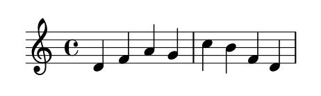

# 1.2.1 简单的乐谱

LilyPond 会自动添加一些乐谱元素。在下面的例子中，我们仅仅指定了四个音，但 LilyPond 加上了高音谱号，拍号和节奏。

```text
{
    c' e' g' e'
}
```


这些行为也许需要改变，但在大多数情况下，自动生成值是很有帮助的。

## 音高

输入音符的最简单的方法是使用`\relative` 模式。在这个模式下，八度音程将会自动被选取，LilyPond 假定下一个音总是会被放在离前一个音最近的位置。也就是下一个音将被置于前一个音的三度音程以内。我们将从键入一条最基本的乐句 _音阶_  开始，其中每个音符只比前一个音符高一度。

```text
% set the starting point to middle C
\relative c' {
    c d e f
    g a b c
}
```


初始音符是中央 C 音。连续的每个音符被放置在离前一个音符最近的地方，换句话说，第一个 `c` 音最靠近中央 C 音。紧随其后的是最近的 D 音。我们可以创作有更大音程的旋律，仍只需使用`\relative` 模式：

```text
\relative c' {
    d f a g 
    c b f d    
}
```




