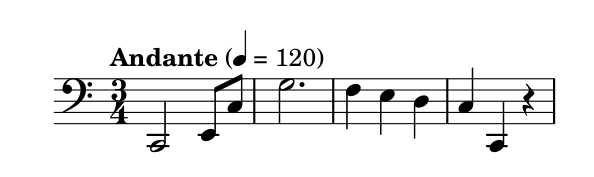

# 整合

下面有一个小例子整合了上面的所有元素：

```text
\relative c, {
    \clef "bass"
    \time 3/4
    \tempo "Andante" 4 = 120
    c2 e8 c'
    g'2.
    f4 e d
    c4 c, r
}
```



更多参考：[语法参考](http://lilypond.org/doc/v2.18/Documentation/notation/index.html)

