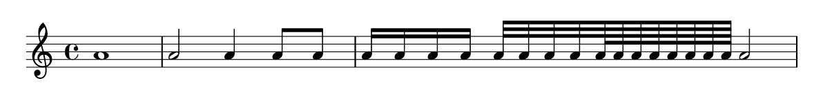
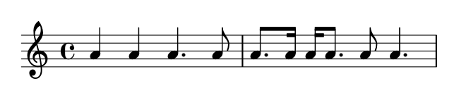

# 时值

音乐术语参考：

1. [beam](http://lilypond.org/doc/v2.18/Documentation/music-glossary/beam)
2. [duration](http://lilypond.org/doc/v2.18/Documentation/music-glossary/duration)
3. [whloe note](http://lilypond.org/doc/v2.18/Documentation/music-glossary/whole-note)
4. [half note](http://lilypond.org/doc/v2.18/Documentation/music-glossary/half-note)
5. [quarter note](http://lilypond.org/doc/v2.18/Documentation/music-glossary/quarter-note)
6. [dotted note](http://lilypond.org/doc/v2.18/Documentation/music-glossary/dotted-note)

音符的时值用音名后紧跟的数字来表示：**1** 表示 _全音符_ ，**2** 表示 _二分音符_ ，**4** 表示 _四分音符_ ，以此类推。 _符干_ 将被自动添加。

如果你没有给定一个时值，前一个音符的时值将被用到下一个音符上。第一个音符时值默认为四分音符。

```text
\relative c'' {
    a1
    a2 a4 a8 a
    a16 a a a a32 a a a a64 a a a a a a a a2
}
```



为了产生 _附点音符_ ，在表示时值的数字后面加一个点`.` 。附点音符的时值必须是已被明确定义的（即音名后有一个数字）。

```text
\relative c'' {
    a4 a a4. a8
    a8. a16 a a8. a8 a4.
}
```




