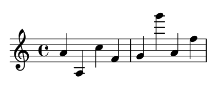

# 音高

输入音符的最简单的方法是使用`\relative` 模式。在这个模式下，八度音程将会自动被选取，LilyPond 假定下一个音总是会被放在离前一个音最近的位置。也就是下一个音将被置于前一个音的三度音程以内。我们将从键入一条最基本的乐句 _音阶_  开始，其中每个音符只比前一个音符高一度。

```text
% 从中央 C 音开始
\relative c' {
    c d e f
    g a b c
}
```


初始音符是中央 C 音。连续的每个音符被放置在离前一个音符最近的地方，换句话说，第一个 `c` 音最靠近中央 C 音。紧随其后的是最近的 D 音。我们可以创作有更大音程的旋律，仍只需使用`\relative` 模式：

```text
\relative c' {
    d f a g 
    c b f d    
}
```


旋律从初始的第一个音开始并不是必要的。在上面的例子中，第一个音`d` 是最接近中央 C 音的 D 调音。

通过在`\relative c'` 指令中添加（或删除）引号`'` 或逗号`,` ，我们可以改变初始八度的位置。

```text
% 比中央 C 高一个八度
\relative c'' {
    e c a c
}
```



注：手册中仅给出了引号`'` 的例子。经过验证，引号`'` 表示上移一个八度，逗号`,` 表示下移一个八度。


相关模式`relative` 开始时也许是会让人有些困惑，但这是输入大多数旋律的最简单的办法。让我们看看相关位置计算实际是如何进行的。从处于高音部中线的 B 音开始，你可以得到高三个音程以内的 C音，D音，E音，以及低三个音程以内的A音，G音，F音。所以如果 B 音后面跟着的是 C, D, 或 E，将会被假定为高于 B 音，而 A, G, F 将会被假定为低于 B 音。

```text
\relative c'' {
    b c % c 在 b 1 个音程之上或者 6 个音程之下，所以 c 是高音
    b d % d 在 b 2 个音程之上或者 5 个音程之下，所以 d 是高音
    b e % e 在 b 3 个音程之上或者 4 个音程之下，所以 e 是高音
    b a % a 在 b 6 个音程之上或者 1 个音程之下，所以 a 是低音
    b g % g 在 b 5 个音程之上或者 2 个音程之下，所以 g 是低音
    b f % f 在 b 4 个音程之上或者 3 个音程之下，所以 f 是低音
}
```


无论音符是高音还是低音，情况都完全相同。在进行相关位置计算时， _意外值_ **完全被忽略**。准确地讲，对于一个音符，在五线谱上的任何一个位置进行音程计算都是一样的。

为了添加间隔大于三个音程的音，我们可以通过在音名旁添加一个单引号`'` （或者称作撇号）来升高一个八度，通过在音名旁添加一个逗号`,` 来降低一个八度。

```text
\relative c'' {
    a a, c' f,
    g g'' a,, f'
}
```



为了改变一个音符两个（或者更多！）八度，我们使用多重记号`''` 或`,,` ——但要主意的是你应该使用两个单引号`''` 而不是一个双引号`"` ！

