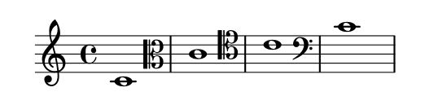

# 谱号

音乐术语参考：

1. [clef](http://lilypond.org/doc/v2.18/Documentation/music-glossary/clef)

谱号可以使用`\clef` 命令生成：

```text
\relative c' {
    \clef "treble"
    c1
    \clef "alto"
    c1
    \clef "tenor"
    c1
    \clef "bass"
    c1
}
```



