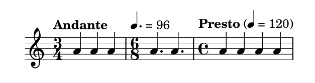

# 速度标记

音乐术语参考：

1. [tempo indication](http://lilypond.org/doc/v2.18/Documentation/music-glossary/tempo-indication)
2. [metronome](http://lilypond.org/doc/v2.18/Documentation/music-glossary/tempo-indication)

_速度标记_ 和 _节奏标记_ 可以通过`\tempo` 命令来生成：

```text
\relative c'' {
    \time 3/4
    \tempo "Andante"
    a4 a a
    \time 6/8
    \tempo 4. = 96
    a4. a
    \time 4/4
    \tempo "Presto" 4 = 120
    a4 a a a
}
```



