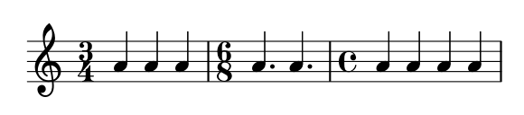

# 拍号

音乐术语参考：

1. [time signature](http://lilypond.org/doc/v2.18/Documentation/music-glossary/time-signature)

_拍号_ 可以使用`\time` 命令生成：

```text
\relative c'' {
    \time 3/4
    a4 a a
    \time 6/8
    a4. a
    \time 4/4
    a4 a a a
}
```



