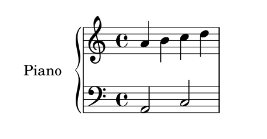

# A.2.1 钢琴独奏

下面是有些音符的钢琴谱。

```text
upper = \relative c'' {
    \clef treble
    \key c \major
    \time 4/4
    a4 b c d
}
lower = \relative c {
    \clef bass
    \key c \major
    \time 4/4
    a2 c
}
\score {
    \new PianoStaff <<
        \set PianoStaff.instrumentName = #"Piano "
        \new Staff = "upper" \upper
        \new Staff = "lower" \lower
    >>
    \layout { }
    \midi { }
}
```



